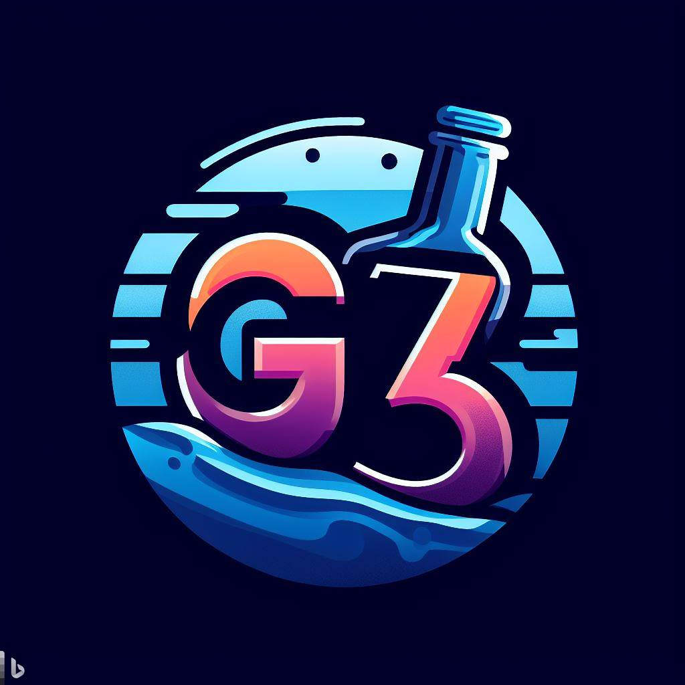

ECOMMERCE DRINK SHOP
- 2 
	El producto a vender sera de bebidas en general
	Nuestra audiencia es para personas mayores de 13 años, de las cuales los comprendidos entre 13 - 17 solo podran tener una cuenta con autorizacion de un tutor
	Los ajustes a tener en cuenta se basan en la edad, ya que los menores de 17 no pueden solicitar bebidas alcoholicas

- 2a 
	Los productos seran categorizados acorde al contenido del envase:
	- bebidas:
		- alcohilicas
		- jugos
		- gaseosas
		- sin azucares
		- agua
		- vinos
		- etc...

	El publico al que apunta el sitio son para personas con problemas de transporte, tiempo o inconvenientes a la hora de realizar compras de manera presencial en locales cercanos, por lo cual la plataforma debe ser de facil acceso, rapida y agil a la hora de comprar un elemento y amigable a la vista para evitar confusiones entre variedades

- 2b 
	Integrantes del equipo:
	- Trejo, Martín
	- Coronel, Atilio Maximiliano
	- Pulitta, Rocío
	- Coali, Nicolas
	- Cortez Alfonso
	

	- Sitios similares, relacionados o de interés:
		- TaDa: es una plataforma enfocada en la misma temática que la nuestra, pero mas centrada en el alcohol
		- Spotify: fue elegida debido a su interfaz adaptable para cada dispositvo, su triple division de pantalla permite al cliente observar y comparar precios de diferentes categorias y un foot contenedor del carrito o del producto seleccionado en ese momento
		- MercadoLibre: Contiene una buena metodología en cuanto a sistema de eleccion para pago, con plataformas limpias y simples de usar
		- Hipotecario: es muy buena app a la hora del manejo de tarjetas o transferencias
		- Instagram: su diseño simple en videos, imagenes y sus comentarios e interaccion con varios usuarios, nos da un buen ejemplo  para el foro o para propagandas

- Enlaces de interes:
	- Trello Intro: https://trello.com/w/ecommercedrinkshopworktable
	- Trello WorkTable: https://trello.com/b/eEk8Ob0H/que-hacer-que-no-hacer
	- GitHub: https://github.com/Martin3jo/Grupo_3_DHComerce
	- WhatsApp: https://chat.whatsapp.com/BPaYL2tRSrI2U3nom9WRgA
	- Discord: https://discord.com/channels/1141453977746157629/1161393524122595390
	- Figma: https://www.figma.com/file/X9aDRGMVxKGTvEEb6DooLr/Untitled?type=whiteboard&node-id=0-1&t=zTGo9wR9HUIgpf54-0

